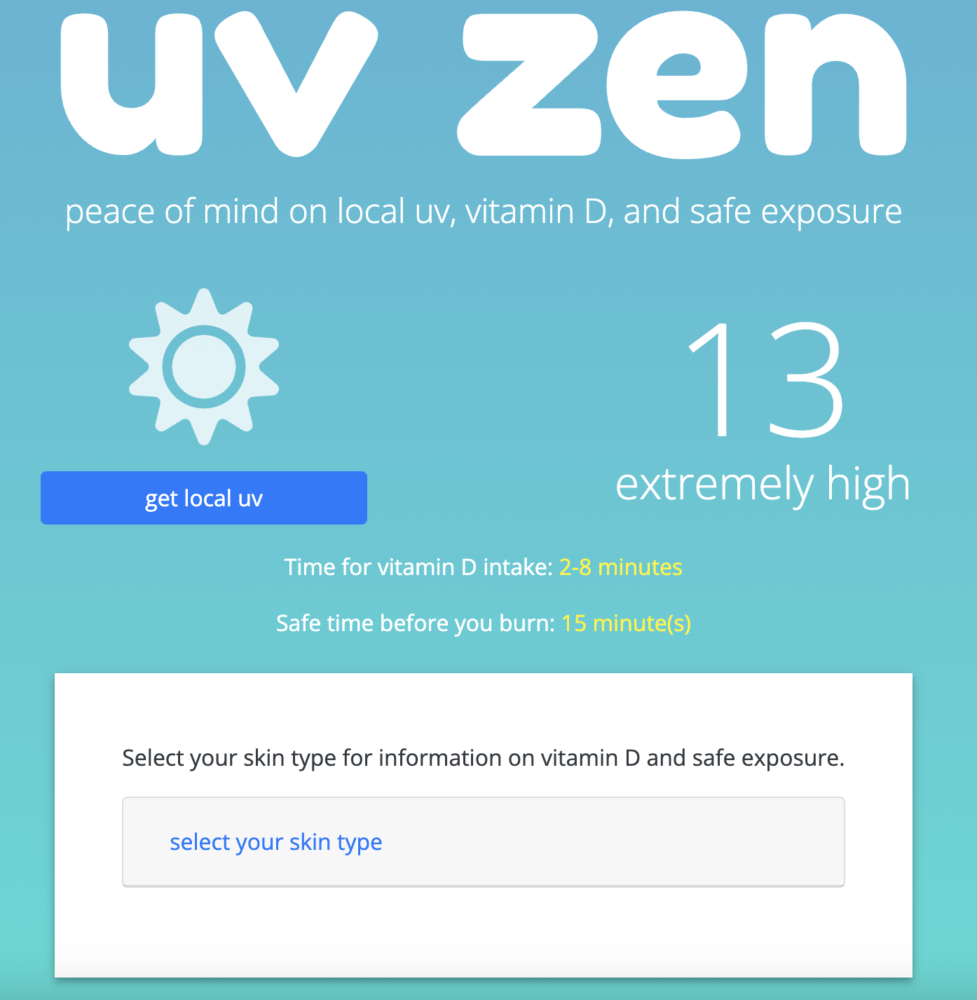

# UV Lens Web App

## Overview

UV Lens is a web app that displays local UV levels, Vitamin D, and sun exposure information. It gives users tailored information on how much sun exposure and vitamin D absorption they need based on their skin type.

## Technologies

- HTML, CSS, jQuery, JavaScript
- Third party weather API
